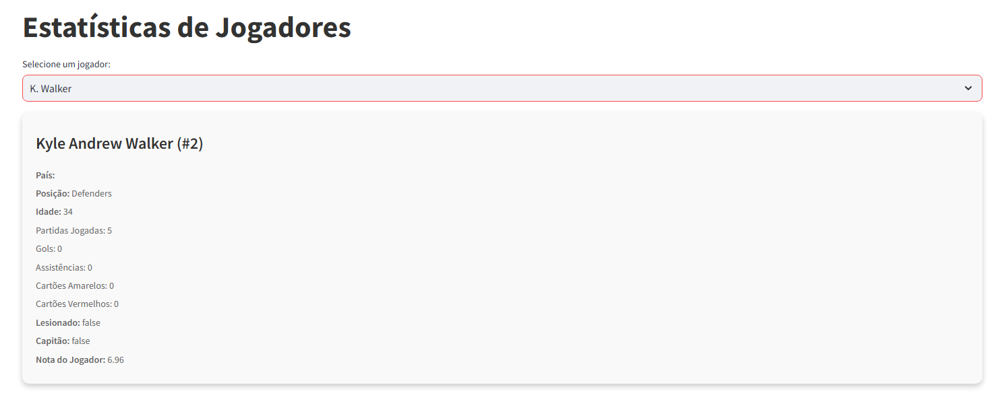

# Futebol API Dashboard

Este projeto visa coletar e exibir informações detalhadas sobre partidas de futebol em um dashboard interativo. Utilizando a [API de Futebol](https://apifootball.com/), o sistema coleta dados extensivos de competições, times, jogadores e partidas, organizando e apresentando as informações de forma visual e intuitiva.

## Funcionalidades

- **Partidas Recentes**: Exibe detalhes de partidas recentes, incluindo times, placar, estádio, árbitro e formações.
- **Informações por País**: Exibe informações de países, permitindo selecionar e visualizar informações básicas.
- **Dados de Times**: Apresenta informações de times de futebol, incluindo país e ano de fundação.
- **Estatísticas de Jogadores**: Exibe estatísticas detalhadas de jogadores, como posição, idade, partidas jogadas, gols, assistências, cartões, e lesões.

## Tecnologias Utilizadas

- **Python**
- **Docker** para gerenciamento de contêineres
- **Alembic** para controle de versão do banco de dados
- **Streamlit** para criação do dashboard interativo
- **PostgreSQL** como banco de dados

## Requisitos

Antes de iniciar, é necessário ter as seguintes ferramentas instaladas:

- **Docker** e **Docker Compose**
- **Python 3.x**
- **Alembic**

## Instalação e Configuração

1. Clone o repositório:
   ```bash
   git clone <URL do Repositório>
   cd futebol-api
   ```

2. Configure o arquivo `.env` para incluir as chaves necessárias, como a chave da API de futebol e configurações do banco de dados.

3. Instale as dependências Python listadas em `requirements.txt`:
   ```bash
   pip install -r requirements.txt
   ```

## Instruções para Execução

Para executar o projeto, siga as etapas abaixo:

1. Inicie os contêineres Docker:
   ```bash
   docker-compose up -d
   ```

2. Aplique as migrações do banco de dados com o Alembic:
   ```bash
   alembic upgrade head
   ```

3. Execute o backend do projeto:
   ```bash
   python3 main.py
   ```

4. Inicie o dashboard com o Streamlit:
   ```bash
   streamlit run view/view.py
   ```

## Estrutura do Projeto

- **alembic**: Controle de versão do banco de dados.
- **api**: Serviços para coleta de dados de competições, países, times e partidas.
- **config**: Arquivos de configuração do projeto.
- **db**: Configuração e serviços de interação com o banco de dados.
- **utils**: Funções utilitárias e agendador de tarefas.
- **view**: Interface do usuário em Streamlit para visualização dos dados.

## Objetivo do Projeto

O principal objetivo deste projeto é coletar e apresentar o máximo de informações possível sobre partidas de futebol, criando uma fonte rica de dados e estatísticas esportivas em um dashboard acessível. Este projeto pode ser expandido para incluir mais dados e visualizações conforme necessário.

## Exemplos de Visualizações

O dashboard apresenta visualizações de dados como:

- Jogos recentes, com placar e detalhes de cada partida.

- Informações detalhadas de times e jogadores.

- Estatísticas de desempenho em várias categorias.

---